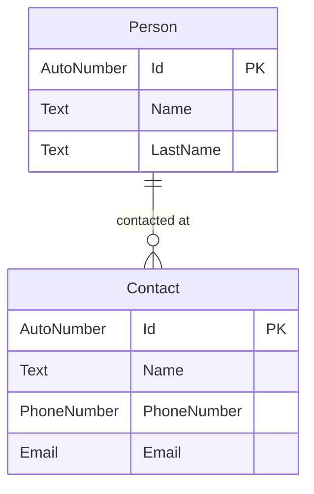

# NoxYamlTest
a sample repo that demonstates how the Nox.solution yaml definition can be used in a project

The yaml definition is in the .nox/design folder.

It produces the following model:

It also demonstates how to use the $ref feature in a Nox yaml definition
```
domain:
  entities:
    - $ref: person.entity.nox.yaml
    
    - $ref: contact.entity.nox.yaml
```
